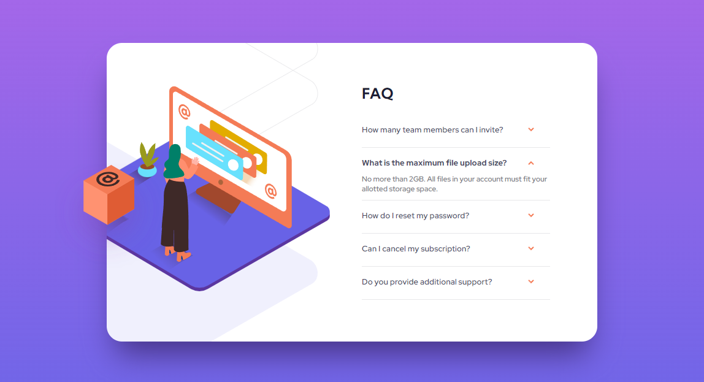

# Frontend Mentor - FAQ accordion card solution

This is a solution to the [FAQ accordion card challenge on Frontend Mentor](https://www.frontendmentor.io/challenges/faq-accordion-card-XlyjD0Oam). Frontend Mentor challenges help you improve your coding skills by building realistic projects. 

## Table of contents

- [Overview](#overview)
  - [The challenge](#the-challenge)
  - [Screenshot](#screenshot)
  - [Links](#links)
  - [Built with](#built-with)
  - [What I learned](#what-i-learned)
  - [Continued development](#continued-development)
- [Author](#author)

## Overview
The reason I chose this project to practice is because this project is seen commonly real life and also it's a good pratice for javascript learner like me. Completed this project independently is a huge step for myself. 

### The challenge

Users should be able to:

- View the optimal layout for the component depending on their device's screen size
- See hover states for all interactive elements on the page
- Hide/Show the answer to a question when the question is clicked

### Screenshot




### Links

- Solution URL: [https://github.com/sunnyyuanz/FAQ-Accordian_Card]
- Live Site URL: [https://sunnyyuanz.github.io/FAQ-Accordian_Card/]

### Built with

- Semantic HTML5 markup
- CSS custom properties
- Flexbox
- CSS Grid
- Javascript

### What I learned

There were few challenges I faced during creating this project. I took courses for CSS Grid because I want to know how to split the image sections and text sections on desktop viewport. There were other css features in this project that I first time associated like background-position and box-shadow. The second big challenge for me was the javascript part. Getting more familiar with querySelectorAll through building this project and also used forEach() for the first time though knowing it for pretty long time. Accidentally learned function can also be writed in "=>" instead of function(){}, even though did not start using it on this one yet. In addition, used seperate CSS sheet with media attribute to implement different look on different size viewports. 

```css
.proud-of-this-css {
  display: grid;
  grid-template-columns: 90% 10%;
  justify-self: end;
  align-self: center;
  position: relative;
  position: absolute;
  background-position: 50% 0%;
  grid-template-rows: 20% 1fr;
  display: flex;
  flex-direction: column;
}
```
```js
const proudOfThisFunc = () => {
  console.log('Basicly Everything in Js🎉')
}
```

### Continued development

Through building this project, I realized my lacking of knowledge at DOM node like how to work with Node objects to better implemente something. Also Need a lot more practice on javascript because figure the javascript for this project took way longer than I originally expected.

## Author

- Website - [SunnyZ](https://github.com/sunnyyuanz)
- Frontend Mentor - [@sunnyyuanz](https://www.frontendmentor.io/profile/sunnyyuanz)

